# Implementation Plan: Layer 13 - Remote Commands Panel

This plan covers the design, architecture, and verification of **Layer 13: Remote Commands Panel** for both the parent app (`:parent-app`) and child app (`:child-app`). 

## 1. Goal Description
The objective of Layer 13 is to build a secure, real-time command control panel where parents can trigger system-level operations on the child's device over Supabase WebSockets.

The commands include:
1. **Lock Device (`LOCK`)**: Forces the child's screen to lock instantly via `DevicePolicyManager`.
2. **Trigger Siren (`ALARM`)**: Loops a high-decibel siren overriding silent and Do Not Disturb profiles.
3. **Block Application (`BLOCK_APP`)**: Remote package addition/removal to restrict app access via the app monitoring service.
4. **Send Warning Message (`MESSAGE`)**: Displays a persistent full-screen warning overlay with custom parent-set text.

---

## 2. User Review Required

> [!IMPORTANT]
> **Android Permissions Required on the Child Device**
> For these system-level commands to execute properly, the child app must have:
> - **Device Administrator Active**: Mandatory to execute `DevicePolicyManager.lockNow()`. Without this, locking will fail.
> - **Display Over Other Apps (`SYSTEM_ALERT_WINDOW`)**: Required to show the full-screen warning overlay on Android 8.0+ (`TYPE_APPLICATION_OVERLAY`).
> - **Usage Access permission**: Needed for package blocking (`BLOCK_APP`).

> [!WARNING]
> **Siren Audio Stream & DND Override**
> The siren uses `STREAM_ALARM` with maximum volume. On some Android versions, if the device is in total silence / priority DND, alarm volumes might be muted. We override this by programmatically increasing the stream volume to the maximum, but we must verify Xiaomi/Realme/Vivo aggressive ROM overrides.

---

## 3. Open Questions

1. **Uninstall Blockage via Device Admin**:
   `GuardianDeviceAdminReceiver` blocks uninstalling by default on Lollipop+ (`dpm.setUninstallBlocked`). Does this require the app to be set as a Device Owner or is it supported via standard Device Admin? (Note: standard Device Admin can block uninstalls in custom vendor ROMs, but in pure Android, standard Device Admin only requests warning popups unless configured via provisioning).
2. **Package Block Input UI**:
   For `BLOCK_APP`, should the parent select from a pre-fetched list of installed apps on the child's device, or is typing the raw package name (e.g. `com.android.chrome`) sufficient for this layer? We propose a simple package name text field with a tactile "Block" button for maximum reliability and zero dependency on a constant heavy app-list sync.

---

## 4. Proposed Changes

```mermaid
sequenceDiagram
    autonumber
    actor Parent
    participant P_Fragment as ControlsFragment (Parent)
    participant P_Repo as ParentRepository (Parent)
    participant DB as Supabase DB
    participant C_SOS as EmergencySOSService (Child)
    participant C_Monitor as AppMonitorService (Child)
    actor Child

    Parent->>P_Fragment: Click "Lock Now" / "Siren" / "Message"
    P_Fragment->>P_Repo: sendCommand(RemoteCommand)
    P_Repo->>DB: Insert row in remote_commands
    DB-->>C_SOS: Real-time broadcast (Insert/Update)
    DB-->>C_Monitor: Real-time broadcast (Insert/Update)
    
    rect rgb(30, 30, 46)
        Note over C_SOS, C_Monitor: Execute Command on Child OS
        C_SOS->>Child: Lock Screen / playAlarm() / showMessageOverlay()
        C_Monitor->>Child: Block App (saveBlockedApps)
    end
    
    C_SOS->>DB: Update remote_commands { is_executed: true, executed_at: now() }
    DB-->>P_Repo: Real-time broadcast (Update)
    P_Repo-->>P_Fragment: Emit updated RemoteCommand status (is_executed = true)
    P_Fragment->>Parent: Show success state! ("Executed at 10:42 PM")
```



### Parent Application (`:parent-app`)

#### [MODIFY] [ParentRepository.kt](file:///c:/Users/ash74/OneDrive/Desktop/SIH-%201/guardian-shield/parent-app/src/main/kotlin/com/guardianshield/parent/domain/repository/ParentRepository.kt)
Add real-time monitoring of recent remote commands so that the UI can update automatically when a command is marked executed.
```kotlin
    fun observeCommands(childId: String): Flow<List<RemoteCommand>>
```

#### [MODIFY] [ParentRepositoryImpl.kt](file:///c:/Users/ash74/OneDrive/Desktop/SIH-%201/guardian-shield/parent-app/src/main/kotlin/com/guardianshield/parent/data/repository/ParentRepositoryImpl.kt)
1. Implement `sendCommand(cmd: RemoteCommand)` to serialize payload and insert into `remote_commands`.
2. Implement `observeCommands(childId: String)` using Supabase `postgresChangeFlow` on `remote_commands` table.
```kotlin
    override suspend fun sendCommand(cmd: RemoteCommand): Result<Unit> = withContext(Dispatchers.IO) {
        try {
            val payloadStr = when (cmd.command) {
                CommandType.BLOCK_APP -> cmd.payload["packages"] ?: cmd.payload.values.firstOrNull() ?: ""
                CommandType.MESSAGE -> cmd.payload["message"] ?: cmd.payload.values.firstOrNull() ?: "Attention!"
                CommandType.ALARM -> cmd.payload["action"] ?: cmd.payload.values.firstOrNull() ?: "start"
                CommandType.LOCK -> ""
            }
            val dto = RemoteCommandDto(
                childId = cmd.childId,
                command = cmd.command.name,
                payload = payloadStr,
                executed = false
            )
            supabaseClient.postgrest.from("remote_commands").insert(dto)
            Result.success(Unit)
        } catch (e: Exception) {
            Result.failure(e)
        }
    }

    override fun observeCommands(childId: String): Flow<List<RemoteCommand>> = flow {
        val dtos = supabaseClient.postgrest.from("remote_commands")
            .select {
                filter {
                    eq("child_id", childId)
                }
                order(column = "created_at", order = Order.DESCENDING)
                limit(count = 10)
            }.decodeList<RemoteCommandDto>()
        
        val list = dtos.map {
            RemoteCommand(
                id = it.id ?: "",
                childId = it.childId,
                command = CommandType.valueOf(it.command),
                payload = if (it.payload != null) mapOf("payload" to it.payload) else emptyMap(),
                executed = it.executed
            )
        }.toMutableList()
        emit(list)

        val channel = supabaseClient.realtime.channel("remote_commands_status_$childId")
        val changeFlow = channel.postgresChangeFlow<PostgresAction>(schema = "public") {
            table = "remote_commands"
        }
        channel.subscribe()

        changeFlow.collect { action ->
            if (action is PostgresAction.Insert || action is PostgresAction.Update) {
                val record = action.record
                val dto = Json.decodeFromJsonElement<RemoteCommandDto>(record)
                if (dto.childId == childId) {
                    val cmd = RemoteCommand(
                        id = dto.id ?: "",
                        childId = dto.childId,
                        command = CommandType.valueOf(dto.command),
                        payload = if (dto.payload != null) mapOf("payload" to dto.payload) else emptyMap(),
                        executed = dto.executed
                    )
                    val idx = list.indexOfFirst { it.id == cmd.id }
                    if (idx >= 0) {
                        list[idx] = cmd
                    } else {
                        list.add(0, cmd)
                        if (list.size > 10) list.removeAt(list.size - 1)
                    }
                    emit(list.toList())
                }
            }
        }
    }.flowOn(Dispatchers.IO)
```

#### [NEW] [fragment_controls.xml](file:///c:/Users/ash74/OneDrive/Desktop/SIH-%201/guardian-shield/parent-app/src/main/res/layout/fragment_controls.xml)
Create a premium dark-themed controls dashboard dashboard that holds command sections.
- **Theme Palette**: Background `#121212`, Card background `#CC1C1C24` (80% opacity dark violet), primary accents `#3B82F6` (Blue) & `#EF4444` (Danger Red).
- **Widgets**:
  - `Spinner` to select child profile.
  - Card for **Lock Device (`LOCK`)** control with large tactile button.
  - Card for **Trigger Siren (`ALARM`)** control with "Start Alarm" & "Stop Alarm" controls.
  - Card for **Send Warning Message (`MESSAGE`)** control containing customized text input `EditText` and trigger button.
  - Card for **Block Application (`BLOCK_APP`)** control with package name text entry, "Block Package" and "Clear Blocked" actions.
  - Scrollable layout support for smooth interaction.

#### [MODIFY] [ControlsViewModel.kt](file:///c:/Users/ash74/OneDrive/Desktop/SIH-%201/guardian-shield/parent-app/src/main/kotlin/com/guardianshield/parent/ui/controls/ControlsViewModel.kt)
Create UI states to capture children profiles, selection state, recent command execution status list, and action logs.
```kotlin
package com.guardianshield.parent.ui.controls

import androidx.lifecycle.ViewModel
import androidx.lifecycle.viewModelScope
import com.guardianshield.parent.data.local.ParentDataStore
import com.guardianshield.parent.domain.models.Child
import com.guardianshield.parent.domain.models.CommandType
import com.guardianshield.parent.domain.models.RemoteCommand
import com.guardianshield.parent.domain.repository.ParentRepository
import dagger.hilt.android.lifecycle.HiltViewModel
import kotlinx.coroutines.Job
import kotlinx.coroutines.flow.MutableStateFlow
import kotlinx.coroutines.flow.StateFlow
import kotlinx.coroutines.flow.asStateFlow
import kotlinx.coroutines.flow.collectLatest
import kotlinx.coroutines.launch
import java.util.UUID
import javax.inject.Inject

sealed class ControlsUiState {
    object Loading : ControlsUiState()
    data class Success(
        val children: List<Child>,
        val selectedChild: Child?,
        val commandsList: List<RemoteCommand>,
        val errorMsg: String? = null
    ) : ControlsUiState()
    data class Error(val message: String) : ControlsUiState()
}

@HiltViewModel
class ControlsViewModel @Inject constructor(
    private val parentRepository: ParentRepository,
    private val parentDataStore: ParentDataStore
) : ViewModel() {

    private val _uiState = MutableStateFlow<ControlsUiState>(ControlsUiState.Loading)
    val uiState: StateFlow<ControlsUiState> = _uiState.asStateFlow()

    private var childrenList = emptyList<Child>()
    private var selectedChild: Child? = null
    private var commandsList = emptyList<RemoteCommand>()

    private var monitoringJob: Job? = null
    private var commandsJob: Job? = null

    init {
        observeChildrenAndSelection()
    }

    private fun observeChildrenAndSelection() {
        monitoringJob?.cancel()
        monitoringJob = viewModelScope.launch {
            val familyId = parentDataStore.getFamilyId()
            if (familyId == null) {
                parentRepository.fetchAndCacheFamilyId()
            }

            parentRepository.observeChildren().collectLatest { children ->
                childrenList = children
                parentDataStore.observeSelectedChildId().collectLatest { selectedId ->
                    selectedChild = children.firstOrNull { it.id == selectedId } ?: children.firstOrNull()
                    
                    if (selectedChild == null) {
                        if (children.isEmpty()) {
                            _uiState.value = ControlsUiState.Success(
                                children = emptyList(),
                                selectedChild = null,
                                commandsList = emptyList()
                            )
                        } else {
                            parentDataStore.saveSelectedChildId(children.first().id)
                        }
                    } else {
                        observeCommandsForChild(selectedChild!!.id)
                    }
                }
            }
        }
    }

    private fun observeCommandsForChild(childId: String) {
        commandsJob?.cancel()
        commandsJob = viewModelScope.launch {
            parentRepository.observeCommands(childId).collect { list ->
                commandsList = list
                emitSuccess()
            }
        }
    }

    private fun emitSuccess(errorMsg: String? = null) {
        _uiState.value = ControlsUiState.Success(
            children = childrenList,
            selectedChild = selectedChild,
            commandsList = commandsList,
            errorMsg = errorMsg
        )
    }

    fun selectChild(childId: String) {
        viewModelScope.launch {
            parentDataStore.saveSelectedChildId(childId)
        }
    }

    fun sendRemoteCommand(commandType: CommandType, payload: Map<String, String>) {
        val child = selectedChild ?: return
        viewModelScope.launch {
            val cmd = RemoteCommand(
                id = UUID.randomUUID().toString(),
                childId = child.id,
                command = commandType,
                payload = payload,
                executed = false
            )
            parentRepository.sendCommand(cmd)
                .onFailure {
                    emitSuccess(errorMsg = "Failed to transmit command: ${it.message}")
                }
        }
    }
}
```

#### [MODIFY] [ControlsFragment.kt](file:///c:/Users/ash74/OneDrive/Desktop/SIH-%201/guardian-shield/parent-app/src/main/kotlin/com/guardianshield/parent/ui/controls/ControlsFragment.kt)
Hook up view binding to UI actions:
- Set up spinner child selected listener (`viewModel.selectChild`).
- Trigger `LOCK` command via `viewModel.sendRemoteCommand(CommandType.LOCK, emptyMap())`.
- Trigger `ALARM` (Start/Stop) via `viewModel.sendRemoteCommand(CommandType.ALARM, mapOf("action" to "start"/"stop"))`.
- Trigger `MESSAGE` via `viewModel.sendRemoteCommand(CommandType.MESSAGE, mapOf("message" to text))`.
- Trigger `BLOCK_APP` via `viewModel.sendRemoteCommand(CommandType.BLOCK_APP, mapOf("packages" to text))`.
- Observe recent activities and show small indicators on whether the commands are pending or executed.

---

### Child Application (`:child-app`)

#### [MODIFY] [AppMonitorService.kt](file:///c:/Users/ash74/OneDrive/Desktop/SIH-%201/guardian-shield/child-app/src/main/kotlin/com/guardianshield/child/services/AppMonitorService.kt)
Currently `AppMonitorService` only handles `BLOCK_APP` commands, but we should make sure that if the parent sends other commands, they can also be observed safely, or keep standard separation:
- `AppMonitorService.kt` listens to `BLOCK_APP` inserts and updates, blocks packages, and updates execution state in Supabase.
- `EmergencySOSService.kt` listens to `LOCK`, `ALARM`, and `MESSAGE` inserts/updates and acts on the system level via DevicePolicyManager, MediaPlayer, and WindowManager overlay, subsequently writing back `{ is_executed: true, executed_at: now() }` upon completion.
*This separation is clean, robust, and maintains separate background isolation.*

---

## 5. Verification Plan

### Automated Verification
Run compile checks on both applications:
```powershell
./gradlew parent-app:assembleDebug
./gradlew child-app:assembleDebug
```
Both projects must compile seamlessly with zero errors.

### Manual Verification
1. **Device Admin Activation**: On the child emulator, enable Device Administrator for Guardian Shield under Settings.
2. **Overlay Authorization**: On the child emulator, authorize the app to "Display over other apps".
3. **Round-Trip Command Test**:
   - Launch parent app and child app simultaneously on two devices/emulators.
   - On the parent app Controls screen, select the active child profile.
   - Click "Lock Device". Ensure `DevicePolicyManager.lockNow()` triggers screen lock on child instantly, and parent logs show the command status moving to "Executed successfully".
   - Click "Start Siren". Ensure the child device overrides quiet volume and sounds the alarm immediately. Click "Stop Siren" to silence.
   - Type `"Return home immediately!"` in warning message input and click send. Ensure the semi-transparent warning overlay appears on the child's screen instantly and blocks touch inputs behind it until "Acknowledge" is clicked.
   - Type `"com.android.settings"` in block application input and send. Open Settings on child device and ensure `BlockActivity` intercepts and blocks it.
