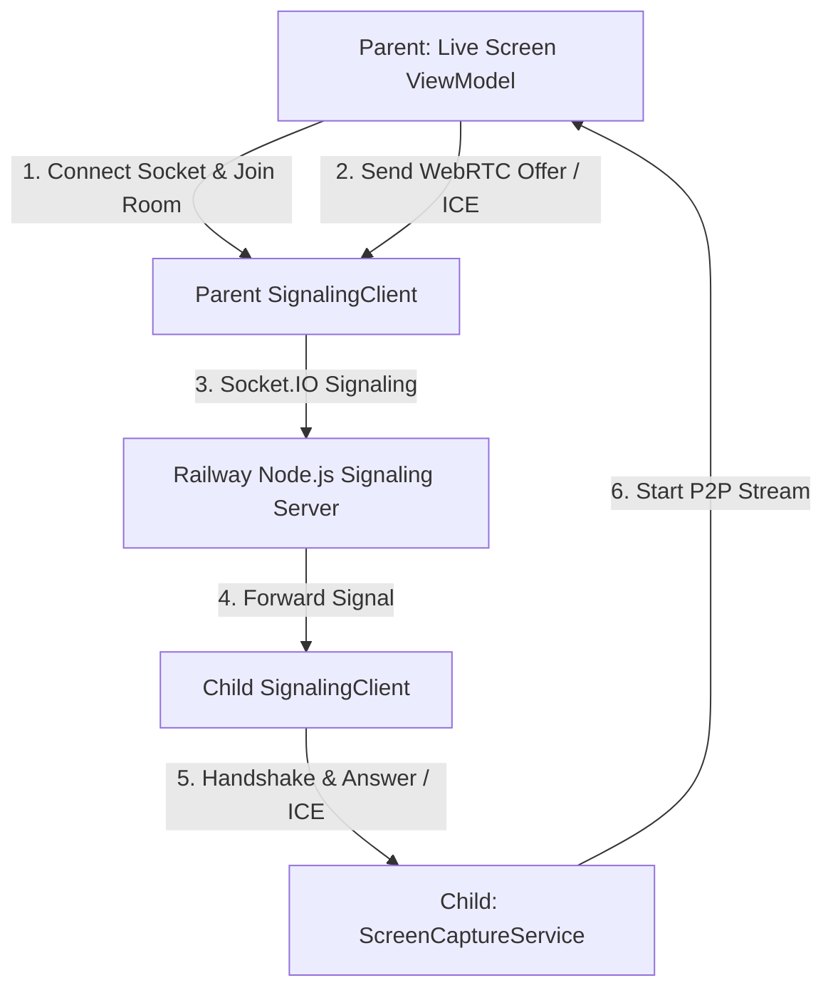

# Implementation Plan — Layer 8: WebRTC Signaling

This document provides a highly secure, performant, and robust architectural plan for establishing **Layer 8: WebRTC Signaling** across `:child-app` and `:parent-app` modules. Signaling serves as the low-latency coordination layer for exchanging SDP offers/answers and ICE candidate metadata before initiating peer-to-peer (P2P) screen-capturing streams in Layer 9 and Layer 11.

---

## User Review Required

We have identified crucial design considerations that require your technical direction:

> [!IMPORTANT]
> **1. Connection Protocol: Ktor Raw WebSockets vs. Socket.IO Client**
> - The root `AGENTS.md` and `PRD.md` state that the signaling server uses **Socket.IO** on Node.js hosted on Railway.app.
> - While we currently have `ktor-client-android` (which supports raw WebSockets) in `libs.versions.toml`, Socket.IO uses a custom framing/polling protocol wrapper (e.g., Engine.io packets). Connecting a raw Ktor WebSocket client directly to a Socket.IO server requires writing manual parsers for packet frames (like `42["event", data]`), which is fragile and error-prone.
> - **Proposal**: We recommend adding the official, production-grade Socket.IO Java/Kotlin client library (`io.socket:socket.io-client:2.1.0` or higher) to `libs.versions.toml`. This ensures resilient engine.io polling fallbacks, heartbeat keep-alives, and clean typed-event listeners out of the box.

> [!WARNING]
> **2. Signaling Server URL Strategy**
> - To avoid hardcoding credentials and server endpoints (violating our strict security rules), we propose loading the signaling server URL dynamically from `local.properties` via `BuildConfig.SIGNALING_SERVER_URL`.
> - If no signaling server URL is configured, we will default to a fallback placeholder like `https://guardian-shield-signaling.up.railway.app` or `http://10.0.2.2:3000` (for emulator-to-local-host testing).

> [!IMPORTANT]
> **3. Activation & Background Battery Lifespan**
> - Aggressive OEM task killing is a major constraint in budget Indian devices. Keeping a persistent WebSocket/Socket.IO connection active *constantly* in the background on the child's phone will drain the battery and trigger OS force-closes.
> - **Proposed Flow**:
>   1. The child app maintains a lightweight **Supabase Realtime** WebSocket subscription (built in Layer 4/7) listening to insertions in the `remote_commands` table (or a specific WebRTC stream-request trigger).
>   2. When the parent opens the **Live Screen Tab**, the parent inserts a remote command `{ command_type: "START_STREAM", payload: { family_code: "XYZ" } }`.
>   3. The child app receives this command via Supabase Realtime in `<1s`, automatically starts `ScreenCaptureService`, connects to the signaling server, and does the handshake.
>   4. When the parent closes the viewer tab, it inserts a `{ command_type: "STOP_STREAM" }` command (or the signaling socket disconnects), prompting the child to disconnect the signaling socket and stop the capture service completely.
>   - *Benefits*: Zero constant background socket overhead, excellent battery utilization (<1% hourly), and full stealth!

---

## Open Questions

Please review the following open questions and provide your feedback:
1. **Should we use the Socket.IO library?** If yes, do you approve adding `io.socket:socket.io-client:2.1.0` to our `libs.versions.toml`?
2. **What is the current Socket.IO event schema for your Node.js signaling server?**
   - For example, does it use the following typical pattern?
     - Parent joins: `socket.emit("join", mapOf("room" to familyCode, "role" to "parent"))`
     - Child joins: `socket.emit("join", mapOf("room" to familyCode, "role" to "child"))`
     - Signaling relay event: `socket.emit("signal", mapOf("room" to familyCode, "type" to "offer/answer/candidate", "payload" to data))`
3. **Do you have the exact Railway.app signaling server URL available now, or should we set it up dynamically via `local.properties` as planned?**

---

## Proposed Changes

We will implement the signaling client module by grouping files into clean domain, data, and UI/Service architecture components across both modules.



---

### Shared Configuration & Dependencies

#### [MODIFY] [libs.versions.toml](file:///c:/Users/ash74/OneDrive/Desktop/SIH-%201/guardian-shield/gradle/libs.versions.toml)
- Add version definition: `socketio = "2.1.0"`
- Add library mapping: `socket-io = { module = "io.socket:socket.io-client", version.ref = "socketio" }`

#### [MODIFY] [child-app/build.gradle.kts](file:///c:/Users/ash74/OneDrive/Desktop/SIH-%201/guardian-shield/child-app/build.gradle.kts)
- Apply the Socket.IO library to dependencies: `implementation(libs.socket.io)`
- Inject `SIGNALING_SERVER_URL` into `BuildConfig` by reading from `local.properties`.

#### [MODIFY] [parent-app/build.gradle.kts](file:///c:/Users/ash74/OneDrive/Desktop/SIH-%201/guardian-shield/parent-app/build.gradle.kts)
- Apply the Socket.IO library to dependencies: `implementation(libs.socket.io)`
- Inject `SIGNALING_SERVER_URL` into `BuildConfig` by reading from `local.properties`.

---

### `:child-app` (Child App Signaling Component)

#### [NEW] [SignalingClient.kt](file:///c:/Users/ash74/OneDrive/Desktop/SIH-%201/guardian-shield/child-app/src/main/kotlin/com/guardianshield/child/data/remote/SignalingClient.kt)
Create the core class responsible for handling low-latency signaling. It will expose a clean, coroutine-friendly flow interface.
- Core functions:
  - `fun connect(familyCode: String)`
  - `fun sendSignal(type: String, payload: String)`
  - `fun disconnect()`
- Exposes `SharedFlow<SignalingMessage>` to stream incoming SDP offers/answers and ICE candidates from the signaling server.

#### [NEW] [SignalingMessage.kt](file:///c:/Users/ash74/OneDrive/Desktop/SIH-%201/guardian-shield/child-app/src/main/kotlin/com/guardianshield/child/domain/model/SignalingMessage.kt)
A data model representing incoming signals:
```kotlin
@Serializable
data class SignalingMessage(
    val type: String,      // "offer", "answer", "candidate", "bye"
    val sdp: String? = null,
    val sdpMid: String? = null,
    val sdpMLineIndex: Int? = null,
    val candidate: String? = null
)
```

#### [MODIFY] [AppModule.kt](file:///c:/Users/ash74/OneDrive/Desktop/SIH-%201/guardian-shield/child-app/src/main/kotlin/com/guardianshield/child/di/AppModule.kt)
- Provide a singleton instance of `SignalingClient` using `@Provides` and `@Singleton`.

#### [MODIFY] [ScreenCaptureService.kt](file:///c:/Users/ash74/OneDrive/Desktop/SIH-%201/guardian-shield/child-app/src/main/kotlin/com/guardianshield/child/services/ScreenCaptureService.kt)
- Inject `SignalingClient` into the service.
- Set up a coroutine to listen for stream commands and manage the socket lifecycle cleanly.

---

### `:parent-app` (Parent App Signaling Component)

#### [NEW] [SignalingClient.kt](file:///c:/Users/ash74/OneDrive/Desktop/SIH-%201/guardian-shield/parent-app/src/main/kotlin/com/guardianshield/parent/data/remote/SignalingClient.kt)
Matching `SignalingClient` in the parent module, allowing the parent-app dashboard to coordinate WebRTC channels.
- Exposes states for:
  - Connection State (Connecting, Connected, Disconnected, Reconnecting)
  - Peer Signal Events (Offer, Candidate, Leave)

#### [NEW] [SignalingMessage.kt](file:///c:/Users/ash74/OneDrive/Desktop/SIH-%201/guardian-shield/parent-app/src/main/kotlin/com/guardianshield/parent/domain/model/SignalingMessage.kt)
Equivalent Kotlin data model representing standard WebRTC messages.

#### [MODIFY] [AppModule.kt](file:///c:/Users/ash74/OneDrive/Desktop/SIH-%201/guardian-shield/parent-app/src/main/kotlin/com/guardianshield/parent/di/AppModule.kt)
- Provide the parent's `SignalingClient` via Hilt.

#### [MODIFY] [LiveScreenViewModel.kt](file:///c:/Users/ash74/OneDrive/Desktop/SIH-%201/guardian-shield/parent-app/src/main/kotlin/com/guardianshield/parent/ui/livescreen/LiveScreenViewModel.kt)
- Inject the parent's `SignalingClient`.
- Implement stream initialization triggers: when the UI is opened, start the signaling client connection, join the room, and listen for incoming child responses.

---

## Verification Plan

Both apps must compile successfully after implementing Layer 8. We will verify correctness through the following checks:

### Automated/Local Compilation Checks
- Run Gradle debug compilation command:
  ```powershell
  ./gradlew :child-app:assembleDebug
  ./gradlew :parent-app:assembleDebug
  ```

### Manual & Integration Verification
1. **Mock Signaling Server**: Run a lightweight Socket.IO node server locally inside the workspace using a scratch script (`C:/Users/ash74/.gemini/antigravity-ide/brain/73d15c08-104e-44b6-a2b5-d6445285c7f0/scratch/mock_signaling_server.js`).
2. **Log Verification**: Connect parent and child apps (using the emulator's `10.0.2.2` mapping or a shared local network IP). Verify in the logs that:
   - Both devices successfully establish connection (`CONNECT` event).
   - Both devices successfully join the specific family code room.
   - SDP offers/answers and ICE candidate JSON packets are exchanged without loss and correctly deserialized in real time.
